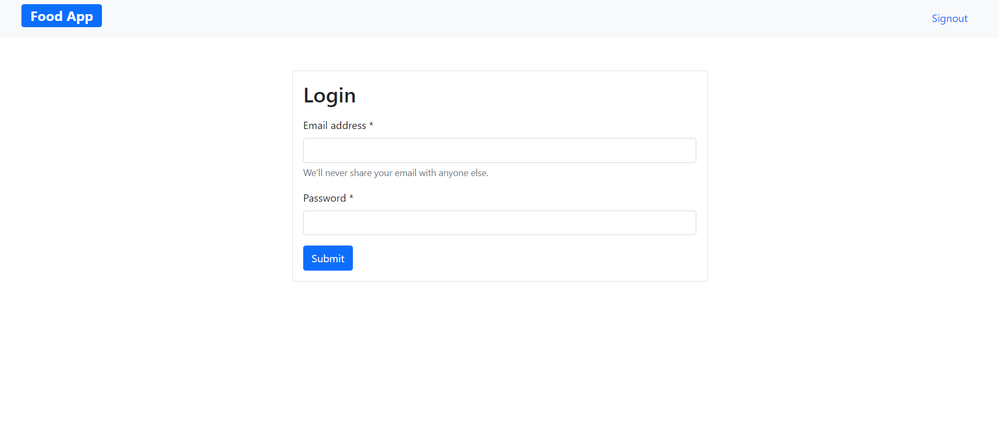

# foodapp-forfoodlovers

A Web App build for foodies :) with exciting items on the menu which they wish it could be delivered to their doorsteps :(  
Build using React.js and bootstrap 5.0

Features this app provides:
1. Signup for new users
2. Login for existing users
3. A range of items to select from
4. Quantity selection for a particular item which the user chooses to buy
5. Custom notification popup when a user places an order successfully

To make this app more userfriendly i have added:
1. Custom validation checks for any missing values on Signup or login
2. Notification popups on successfully placing an order
3. Calculation of the final amount that needs to be payed based on the quantity of a particular item purchased.

### Signup page for new users

### Custom validation checks for every required feild on signup or login

### Login page for existing users

### App homepage showing list of food items

### Placing an order

### Notification popup on successfully placing an order

